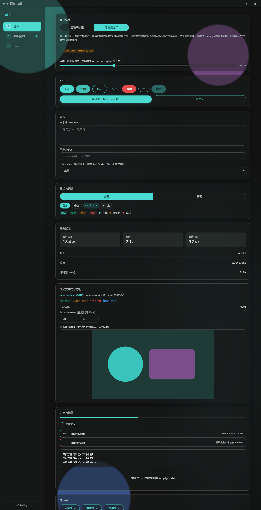
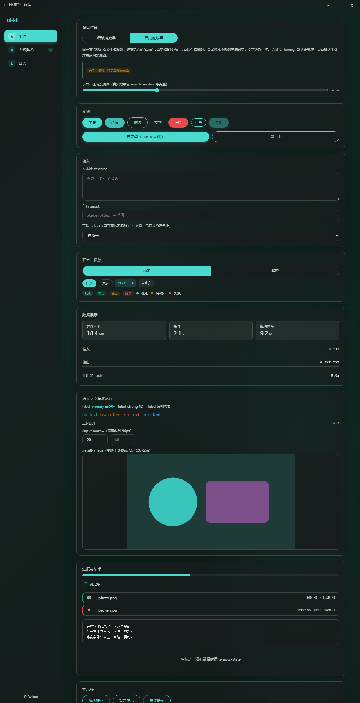

# @rolling/ui-kit

Rolling 的 Tauri 桌面应用界面套件。把原本在多个项目里各抄一份的毛玻璃 UI，收成一套可升级的公共资产。

原先是三份互相分叉的手工拷贝（Base64 Tool Desktop、S2PNG Tool Desktop、Keypad Tool）：
同一个视觉体系、三份不同的实现，修好的改动无法回流 —— S2PNG 里修好的边框可见度，Base64 里并没有。
本仓库是这套 UI 的唯一真源。

## 效果图

原生 Acrylic 模糊生效时（背后是 demo 自造的假桌面）：



无原生模糊的平台自动切换不透明兜底底色（同一套 CSS，保证可读性）：



已用于：[ProjectHub](https://github.com/Rolling-39/ProjectHub)（开源）· Base64 Tool Desktop · S2PNG Tool Desktop · Keypad Tool

| | |
|---|---|
| 前端 | 原生 ES 模块 + 纯 CSS，无框架、无预处理器，Vite 直接吃 |
| 原生 | 独立 Rust crate `tauri-ui-kit`，只依赖 `tauri` / `serde` / `window-vibrancy` |
| 许可 | MIT |
| 验证范围 | 仅 Windows 实机验证过。macOS / Linux 未实测 |

---

## 一、这个目录够不够用

**前端侧够用，原生侧不够。** 换句话说：不能只把这个目录复制进项目就完事。

| 部分 | 能否由本目录直接提供 |
|---|---|
| 主题变量、组件样式、窗口骨架、导航与面板生命周期、日志与提示条 | 可以，`import` 即可 |
| 窗口背景（Acrylic/Mica/Vibrancy）的应用与生效探测 | 逻辑在本目录，但**命令必须由你的应用注册** |
| 窗口最小化/最大化/关闭、前端日志落盘 | 同上，**必须由你的应用注册** |
| 窗口尺寸、`decorations`/`transparent`、`capabilities` 权限 | 不能，属于每个应用自己的配置 |
| 业务界面（编码页、灯效页、键位页） | 不能，也不应该 —— 那是业务，不是 UI 套件 |

原因是 Tauri 的架构决定的：`invoke_handler` 只能由生成 `tauri::Context` 的那个应用声明，
一个库没办法把自己"塞进"别人的 handler 里。所以每个项目都要做一次约 10 行的接线。

接入要做的四件事（详见 [docs/USAGE.md](docs/USAGE.md)）：

1. `npm install ../ui-kit` —— 装成 `file:` 本地依赖
2. `Cargo.toml` 加 `tauri-ui-kit = { path = "../../ui-kit/rust" }`
3. `main.rs` 里注册 7 个命令，并调用 `boot_log` / `spawn_ready_probe`
4. 复制 `src/shell.template.html`，照抄 `tauri.conf.json` 的窗口与 `capabilities` 片段

**另外注意本套件是本地路径依赖**：那三个项目与 `ui-kit` 的相对位置关系是硬编码在 `Cargo.toml` 的 `path` 里的。
`ui-kit` 目录被移动、改名、或项目被挪到别处，都要同步改路径。若以后想避免这个问题，可以把
`ui-kit` 推到私有仓库改用 git 依赖。

## 二、它提供什么

| 能力 | 说明 |
|---|---|
| 主题 | 一套 CSS 变量定义全部配色、圆角、字体、阴影；品牌色用 RGB 三元组派生，换主题只改一处 |
| 主题锁定 | 原生支持 `html[data-theme="light"\|"dark"]`。亮暗取值不同的量成对定义，跟随系统与手动锁定两条路径共用同一份值；`color-scheme` 一并切换，所以原生绘制的控件装饰也跟着走。**消费方不需要把调色板抄进自己项目** |
| 窗口背景 | Windows Acrylic / Mica、macOS Vibrancy 的应用，**并把"到底生没生效"回报给前端** |
| 窗口骨架 | 自定义标题栏（含拖拽区）、侧栏导航、内容区、响应式断点 |
| 组件 | 卡片、按钮 6 种、输入 4 种、分段开关、标签块、徽标、状态点、指标网格、键值行、结果区、进度条、加载行、提示条等 |
| 面板框架 | 面板清单注册、懒加载、`destroy`/`refresh` 生命周期、`#面板名` 直达路由、导航角标。切换时**原子替换**：新面板先以隐藏的"待定"状态建好，就绪后再撤旧面板并揭示，所以看不到"只有骨架、数据还没到"的中间帧；启动后空闲预热其余面板模块（`prefetchPanels`，可关） |
| 工具 | 日志（内存 + 面板 + 落盘三路）、提示条、`el()` DOM 构造、文件大小/时间/耗时格式化、UTC 时间串转本地时间（`fmtIsoLocal`）、事件总线 |
| 排障 | 前端异常自动落盘到 `frontend.log`、启动日志、启动后页面探活 |

它**不**提供业务组件。键盘可视化（`.keycap`/`.stage`）、宏编辑器、测试网格、色板这类带业务含义的东西留在各自项目里。

## 三、五个设计决策，以及为什么这么做

这几条都是踩过坑之后才定下来的，改动它们之前先读理由。

### 1. 背景默认不透明，确认生效才转透明

真正在模糊的是窗口后面的桌面（DWM），CSS 只负责把表面做成半透明。而原生模糊**不是所有平台都有**：
Linux 没有，Windows 10 1809 以下没有。如果默认就把窗口做成透明 + 表面 0.15 不透明度，
在这些平台上得到的是「文字直接糊在桌面上」，而用户只会以为是自己眼花了。

所以顺序是反的：兜底底色是**页面内的一层** `.backdrop-fallback`（写在 HTML 首屏），
`theme.js` 调原生命令拿到 `applied: true` 才给 `<html>` 加 `.backdrop-ok` 把这层撤掉。
失败模式的严重程度从"不可读"降到"只是不好看"。

这层**不能**写成 `<html>` 的 `background`。"原生模糊生没生效"要等一次 Rust 往返才知道，
靠切换 `<html>` 的背景，切换前会先闪一下不透明渐变再变成透明玻璃。页面内的一层从第一帧就在，
中间没有任何一帧的错误背景。

### 2. 着色值放在 CSS 里，不放 Rust 里

窗口背景的 tint 定义在 `tokens.css` 的 `--backdrop-tint`，前端读出来传给原生层。
原先三个项目都是在 `main.rs` 里硬编码 `Some((18, 18, 18, 64))`，后果是换主题要改 Rust 并重新编译，
而且同一个字面量被抄进了三个仓库。

**但要清楚它的边界**：`window-vibrancy` 在 Windows 上是分档实现的，
Win11（build ≥ 22523）走 `DwmSetWindowAttribute(DWMWA_SYSTEMBACKDROP_TYPE)`，这条路径**忽略传入的 tint**。
所以 tint 只在 Windows 10 上真正起作用。不要承诺"改 CSS 就能改 Win11 背景色"。

**不过"明暗"这一维是可控的**（2026-10-05 补）：Win11 虽然不认颜色，但认 DWM 的
immersive dark mode，也就是 `window-vibrancy` 里 `apply_mica` 的第二个参数。
所以前端还会把"当前档位是亮还是暗"一起传下去（`readBackdropDarkness()` 从 CSS 的
`color-scheme` 推断）。这条是必须的：应用里手动锁定亮色而系统是深色时，只切 CSS 变量
会得到"深色文字糊在深色 Mica 上"，实测那台机器上侧栏标签与背景的对比度掉到 1.13。

**这个参数必须是具体的 `true`/`false`，连"跟随系统"档也要在前端解析掉。**
`apply_mica` 的实现是 `if let Some(dark) = dark { ... }` —— 传 `None` 不是"跟随系统"，
而是"这一帧什么都不做"，DWM 属性会停在最后一次设过的值上。踩过一次：
应用内锁浅色（属性被写成浅）→ 切回"跟随系统"（传 `None`，属性没被改）→ 系统是深色、
CSS 已经变深，窗口底却还是浅的，正文对比度实测只剩 1.39。
现在 Rust 侧那个参数是必填的 `bool`，这类静默失败不可能再出现。

原生后端控制不了明暗的场合（Win11 走 acrylic、macOS 的 vibrancy），命令会回报
`dark_honored: false`，前端随即补一层与当前档位一致的底色（`html.backdrop-forced`）兜住对比度。
**所以"锁了亮色却变成深色"这类问题不会再出现，代价是那种后端下玻璃质感会弱一点。**
补底色只在**锁定档**做：跟随系统档原生背景本来就跟着系统走，与 CSS 天然一致。

### 3. 命令必须放在 Rust 子模块里

`#[tauri::command]` 作用在 `pub fn` 上时会生成两个带 `#[macro_export]` 的宏，
而 `macro_export` 只能把宏放到 crate 根；紧接着宏还会生成一份 `pub use __cmd__xxx;`，
于是在根模块里「宏已存在」和「再导入一次」正面撞车，报 `E0255`，一条命令两个错误。

| 位置 | 可见性 | 能否编译 |
|---|---|---|
| crate 根（`main.rs` / `lib.rs`） | 私有 `fn` | 可以 |
| crate 根 | `pub fn` | **不行**，E0255 |
| 子模块（`commands.rs`） | `pub fn` | 可以 |

所以本 crate 的命令都在 `rust/src/commands.rs` 里，从 `lib.rs` 用 `pub mod commands;` 暴露，
且**不做 glob 重导出**（`pub use commands::*;` 会让冲突回到根模块）。下游引用路径是
`tauri_ui_kit::commands::xxx`。你自己的业务命令同理。

### 4. 桌面端的日志必须落盘

桌面端没有控制台，前端一抛异常，用户看到的就是白屏或"点了没反应"，拿不到任何信息。
所以套件里日志走三路：内存环形缓冲（供日志面板）、`console`（浏览器调试）、
`frontend.log`（进程崩了也能事后查）。`installErrorReporter()` 会把
`window.onerror` 与 `unhandledrejection` 全部接住并落盘。

### 5. 切换面板：先建好再换，不先清空

最直觉的写法是"清空内容区 → 建新面板"，但那会露出中间态：屏幕上只剩几个表头，
列表和卡片都还是空的。数据一到位就"啪"地补上，观感就是切换时闪一下。

所以 `showPanel()` 的流程是：**先把新面板建好（挂成 `.panel-pending`，绝对定位 + 不可见，
不影响布局），旧面板原地留着；等新面板就绪后再同一帧撤旧 + 揭示 + 复位滚动。**
慢面板最多等 150ms，到点就先显示骨架，不让用户对着上一个界面发呆。

这带来一条**面板契约**：`mount()` 返回的 promise 落地就代表"首屏已渲染完"。
要先把数据取回来才能画的面板**必须 `async` 且先 `await` 首次取数** —— 返回得太早，
shell 就以为它准备好了，空骨架又会被看见。完整流程见 [docs/REFERENCE.md](docs/REFERENCE.md)，
契约写法见 [docs/USAGE.md](docs/USAGE.md#3-面板契约)。

入场动画（`.panel-in`，0.3s 上移 14px）在**揭示那一刻**才挂上。写在 `.panel.active` 上不行：
待定阶段的元素已经存在，动画会在不可见时就跑完，揭示时什么都看不到。动画只动 `transform`
不动 `opacity`——从 `opacity: 0` 入场会让首帧看起来是空的，等于把刚去掉的空帧加回来。

## 四、平台支持

| 平台 | 后端 | 结果 |
|---|---|---|
| Windows 11 build ≥ 22523 | `DwmSetWindowAttribute(SYSTEMBACKDROP_TYPE)` | 生效。**传入的 tint 被忽略**；背景的明暗由应用传下去的 `dark` 决定（锁定亮暗时能跟着走） |
| Windows 10 build ≥ 17763 | `SetWindowCompositionAttribute(ACRYLICBLURBEHIND)` | 生效，tint 有效。已知拖动/缩放窗口会卡顿（上游用的非公开接口） |
| Windows 10 更低版本 | — | 返回错误 → 前端自动切兜底底色 |
| macOS | `NSVisualEffectMaterial::HudWindow` | 生效（**未实测**）。明暗跟随系统外观，应用锁定不了 |
| Linux | — | 无原生模糊 → 自动切兜底底色 |

`createShell` 的 `backdropBackend` 可选 `'acrylic'`（默认，与现有项目观感一致）、
`'mica'`（仅 Win11，走 DWM 原生，可避开上面那条拖动卡顿）、`'auto'`。
`useBackdrop: false` 可强制使用兜底底色。

运行日志里会打出实际走的后端和 Windows 构建号，排查"这台机器为什么没效果"时先看这一行。

## 五、目录

```
ui-kit/
├── README.md                 本文件：介绍与设计决策
├── docs/
│   ├── USAGE.md              使用文档：接入步骤、最小示例、场景、排查
│   ├── REFERENCE.md          参考：CSS 变量/类、JS API、Rust 命令
│   └── MIGRATION.md          迁移手册：从三个旧项目迁过来要改什么
├── src/
│   ├── index.css             样式入口，按 tokens → shell → glass 顺序聚合
│   ├── tokens.css            主题唯一真源
│   ├── shell.css             窗口骨架与背景策略
│   ├── glass.css             通用组件
│   ├── tauri.js              Tauri 桥接，浏览器里降级为桩函数
│   ├── ui.js                 日志、提示条、DOM 构造、格式化、事件总线、异常上报
│   ├── theme.js              原生背景的应用与生效探测
│   ├── shell.js              createShell：标题栏 + 导航 + 面板生命周期 + 路由
│   └── shell.template.html   窗口骨架模板
├── rust/                     独立 crate：tauri-ui-kit
├── scripts/check-docs.py     文档一致性检查，见下
└── demo/                     组件预览，不需要 Tauri、不需要构建
```

## 六、预览与自检

```bash
# 组件预览（不需要 Tauri、不需要构建）
python -m http.server 8899 --directory <本仓库路径>
# http://127.0.0.1:8899/demo/      加 ?blur=1 看玻璃效果

# 文档一致性检查（五件事，见下）
python scripts/check-docs.py

# package.json 的 exports 是否都指向真实存在的文件
node scripts/check-exports.mjs

# 原生侧编译校验
cargo check --manifest-path rust/Cargo.toml --offline
```

`demo/preview-blur.png` 是有原生模糊时的样子（背后是 demo 自己造的假桌面），
`demo/preview-fallback.png` 是没有原生模糊时的兜底样子。两者用的是同一套 CSS。

**改了代码或文档都要跑一遍这两个脚本。** `check-docs.py` 挡五类错误：

1. 内部链接失效、锚点对不上（中文标题尤其容易）
2. 文档里承诺了源码里并不存在的函数 / CSS 变量 / CSS 类
3. **主题锁定块覆盖不完整** —— `html[data-theme]` 漏掉某个亮暗有别的变量，或忘了声明 `color-scheme`。
   这类漏掉不会报错，只会让"系统暗 + 手动锁亮"时界面变成杂交态，所以必须机器查
4. **shell 钩子漂移** —— `shell.js` 依赖的 id 不在模板里，或 USAGE 的接入清单没提它
5. 重复锚点

`MIGRATION.md` 刻意不参与第 2 条里的"类名必须存在"检查：它本来就要点名一批属于各项目的
业务类（`device-card` 之类），那些不属于套件。

`.github/workflows/ci.yml` 会在 push / PR 时跑上面这些，以及 `cargo check` 与"装成 `file:` 依赖后
exports 仍能解析"。已在 GitHub Actions（`windows-latest`）上通过。

它自己踩过两个坑，都记在文件头了：YAML 值里的 `": "` 会被当成映射分隔符（整个工作流解析失败、
运行耗时显示 0s）；`check-docs.py` 的输出是中文，而 runner 的 stdout 默认是 cp1252 —— 现在脚本
自己 `reconfigure(encoding='utf-8')`，不再依赖运行环境的控制台编码。

## 七、状态

已验证：

- `cargo check` 通过（离线，Windows 目标）
- 无头 Edge 实拍确认骨架、导航、角标、hash 路由、面板加载失败兜底、兜底底色、玻璃态透出
- **主题锁定用 CDP 实测过 18 组组合**（系统深/浅 × 跟随/锁亮/锁暗 × 本项目 / 仅套件）：
  锁亮拿到浅色表面且 `color-scheme: light`，锁暗反之，跟随系统与改动前一致。
  对照组的旧版本有 4 组不通过
- `scripts/check-docs.py` 的新检查做过故障注入验证：抽掉 `color-scheme`、抽掉任一亮暗成对
  变量、在 USAGE 里点名不存在的类、shell.js 引用模板里没有的 id，四类都能被抓到
- `scripts/check-exports.mjs` 同样做过故障注入（给 exports 加一条不存在的路径）
- **面板切换用逐帧采样实测过**：可见面板数全程恒为 1、可见卡片数从不掉到 0；
  另外注册了一个"慢面板"（`mount` 里先挂骨架、80ms 后才有数据）来复现真实延迟，
  把 shell 的等待时机改成立刻揭示（`REVEAL_MAX_MS = 0`）能让断言失败
  （零卡片帧 5/24、最小卡片数 0），改回来即通过
- **七个缺陷做过"修复前 / 修复后"的 CDP 对照实测**：`useBackdrop:false` 被系统切主题推翻、
  首面板 `mount` 挂死、首面板等待期 handle 泄漏、demo 按钮没走事件总线、无焦点体系、
  `.chip` 键盘不可达、提示条无 aria。修复前 **7/7 复现**、修复后 **0/7**，每条都留了数字
  （例：泄漏那项的定时器从"38 → 51 持续增长"变为"25 → 25 停止"）。
  探针是一次性的，跑完即删，不留在仓库里
- **骨架钩子校验的四种情形实测过**：钩子齐全 / 缺 `tbTitle`（可选，仍能正常启动）/
  缺 `tbMax`（抛错并点名）/ 缺两个（两个都点名）。`tbTitle` 刻意不做必需项 ——
  Base64 与 S2PNG 的 `index.html` 都没有它，不该因为一个纯展示元素让整个应用起不来
- 主题锁定、面板切换、钩子校验之外，`check-docs.py` 的 `check_shell_hooks()` 也做过故障注入：
  在 `shell.js` 注释里写一次「美元符号加圆括号」的字面量，就会被它抓出一个假钩子并让 CI 失败

未验证 / 已知限制：

- macOS 与 Linux 没有实机跑过。macOS 分支的 `apply_vibrancy` 用的是 0.6 的四参数签名，能编译，但没跑过。
- Win10 上 acrylic 用非公开接口，拖动窗口可能卡顿；Win11 可改用 `mica`。
- `tauri.conf.json` 的 `csp` 建议不要留 `null`。需要放行非 `'self'` 资源时显式写策略。
  注意：收紧 CSP 属于阻断型改动（写错会让页面白屏或图片全不加载），**必须在实机上验证放行清单之后再改**。
- `.github/workflows/ci.yml` 已在 GitHub Actions（`windows-latest`）实跑通过：文档自检、
  exports 自检、`cargo check` 三步全绿。仍未覆盖的是真机部分——原生模糊的观感、平台差异，
  那些 CI 看不见。
- **延迟类缺陷在浏览器里天然复现不出来**：mock 数据走微任务、跨不过一帧，
  所以"骨架已挂、数据没到"那一帧不会被画出来。要验证这类修复必须自己造慢面板，
  不能因为"测试全绿"就认定修好了。
- 三个旧项目的 `apply_vibrancy` 写的是 0.6 之前的两个参数版本；那段代码在
  `#[cfg(target_os = "macos")]` 下、又都没有 macOS 构建，所以"编译不过"这件事一直没暴露。
- `rust/Cargo.toml` 里同时出现在 `[dependencies]` 和 `[build-dependencies]` 的 `indexmap` 是**环境适配，别删**
  （`schemars` 的 E0107，详见 [docs/USAGE.md](docs/USAGE.md#5-依赖里的-indexmap-不是笔误)）。

---

© Rolling · MIT
